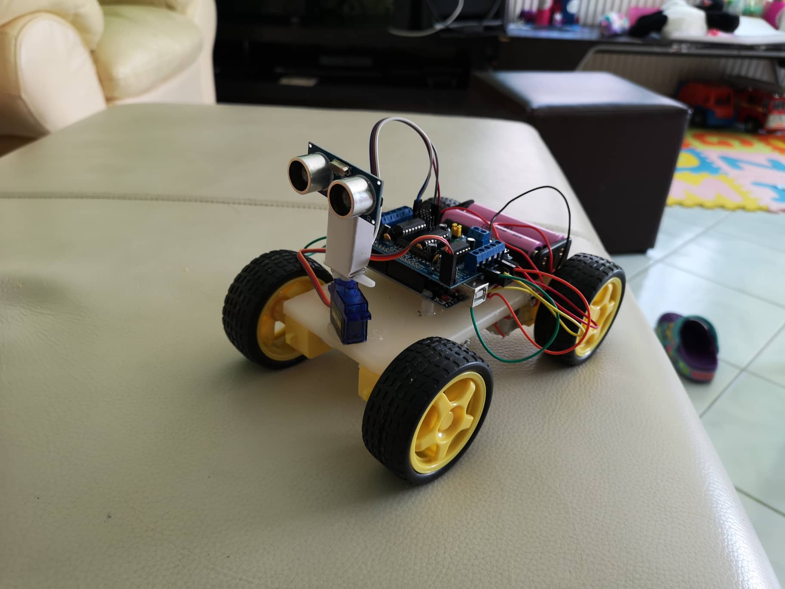
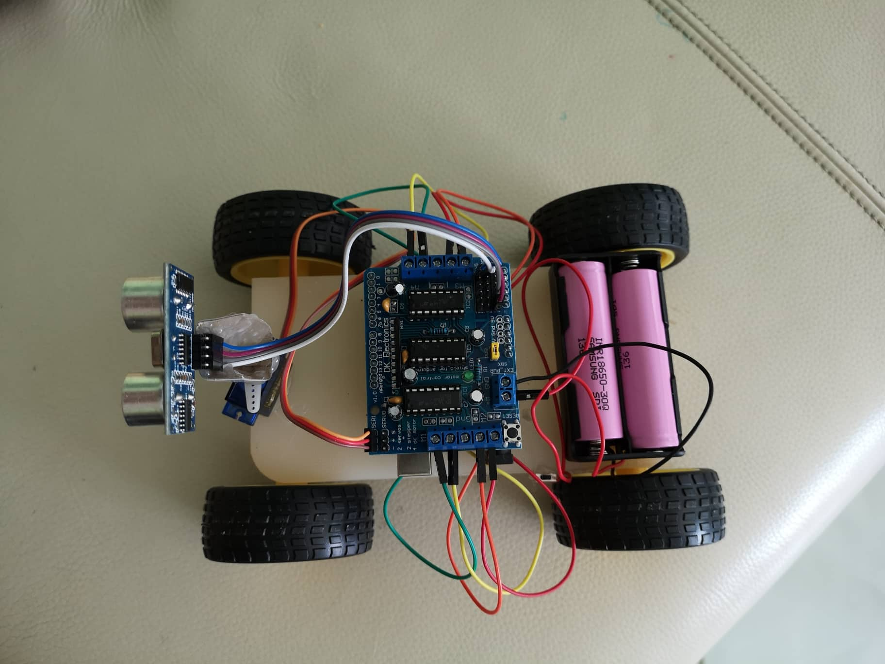

# ultrasonic_robocar
Code for an ultrasonic robot car based on an arduino uno and a motor shield. An ultrasonic sensor on a servo motor checks obstacles and emits a direction change if needed.

Profile:

Wires:

Part list:
1. Arduino Uno - https://bit.ly/2Fz8M4q
2. Motor Driver Shield - https://bit.ly/2VWaYsn
3. Wheels - https://bit.ly/2suQJEY
4. TT Gear Motors - https://bit.ly/2Rtg2G9
5. Servo Motor - https://bit.ly/2Soq7E4
6. Ultrasonic Sensor - https://bit.ly/2RzebL7
7. 18650 Li-on Battery (2x) - https://bit.ly/2CZabQ7
8. Battery Holder - https://bit.ly/2sulLwu
9. Male and Female Jumper wire - https://bit.ly/2su6mfM
10. DC Power Switch - https://bit.ly/2FtyEzs
